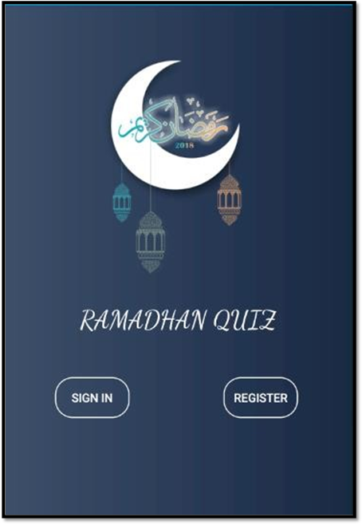
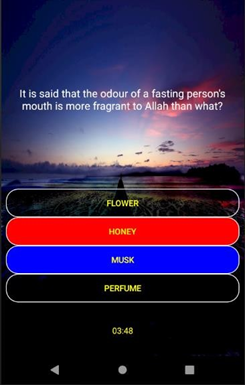
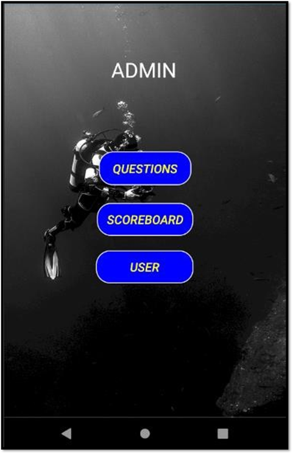
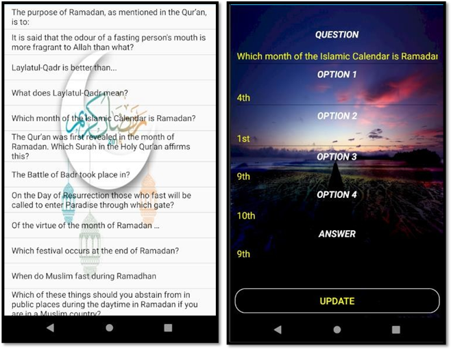
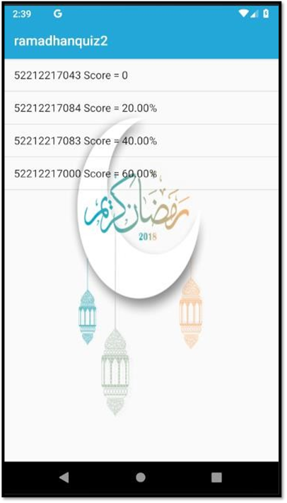

"# RamadhanQuizApp" 

<h1>Main Page</h1>

Here is the first interface when user open the app

<h1>Register</h1>

Here is register page that need user to enter ID Number, name and password. The data will be saved to the Firebase.

<h1>Sign In</h1>

After register or already have account, user will sign in first before get access to main form.

<h1>Question view</h1>

The question will retrieved from the Firebase, the right answer will turn to blue while wrong turn to red when the user click the button 
At the bottom of the page there are time limit to make it interesting.

<h1>Result view</h1>

It will show the percentage of the marks, the correct answer and the wronganswer.
 The score will be saved into the Firebase inreal-time.

<h1>Admin Page</h1>

This is where the Admin can make editing can view the results.
 There are several button to be clicked such as Questions, Scoreboard and User.

<h1>Admin Page(list of question)</h1>

Here Admin can see the list of questions and can choose which one to edit.
 Every questions that have been edited will be uploaded and updated in the
database.

<h1>Scoreboard</h1>

Admin can see the list of the users and scores.
 The score are retrieved from the database. Score are arranged by lowest to the highest.

<h1>User List & Update User</h1>

Admin can check the list of the user here by ID number.
 The score are retrieved from the database. Score are arranged by lowest to the highest.

project members
 Amir Aminuddin
 Muhammad Amir Asyraf
 Fadzrol Azua

